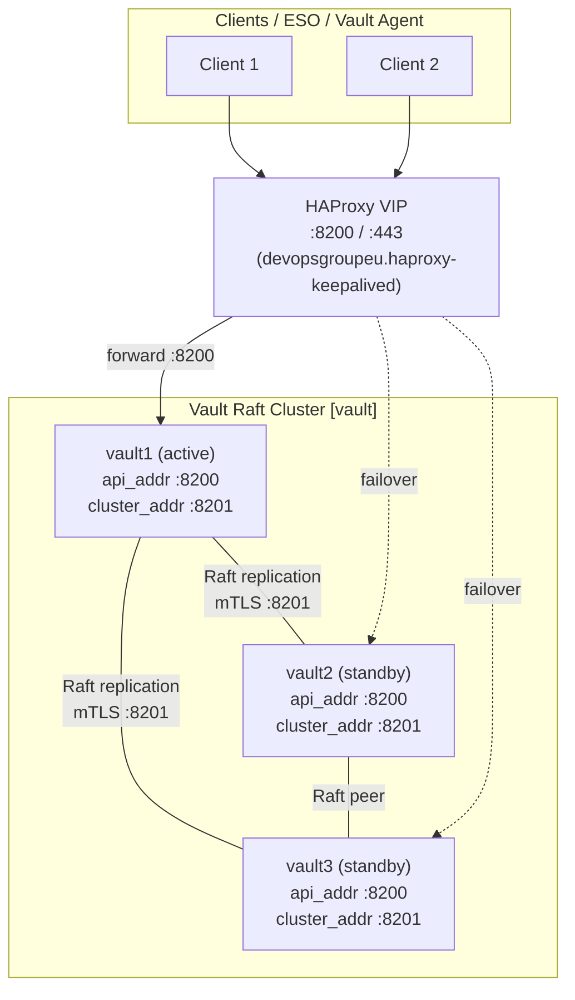
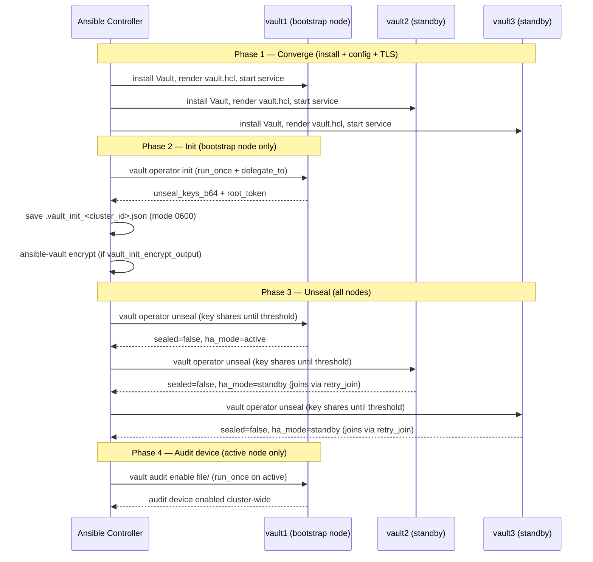

# Architecture

This document describes the Vault deployment topology produced by this role and
the operational flows for cluster init and unseal.

---

## Raft HA Topology

A three-node Vault Raft HA cluster is the recommended minimum for production.
One node acts as the active leader; the other two are standbys. Raft replication
is synchronous — writes are committed once a quorum (n/2 + 1) of nodes has
acknowledged.



**Key design points:**

- `vault_listen_address` is the listener bind; `vault_api_addr` is the *advertised* address.
  In a VIP-fronted cluster both should use `https://` with the node's own IP so that
  `retry_join` peer resolution works without DNS.
- `retry_join` blocks are derived from `vault_raft_peers` (defaults to
  `groups['vault']`). The port is extracted from `vault_listen_address` so a
  non-default API port is honoured without manual override.
- TLS is required on both the API listener (:8200) and the cluster listener (:8201).
  The `vault_tls_leader_servername` SAN must appear on every node cert (Go removed
  CN matching in 1.17).
- `vault_disable_mlock: true` is required for Raft (BoltDB uses mmap). Pair with
  `vault_manage_swap: true` to prevent key material being paged to disk.

---

## Init and Unseal Sequence

The role performs idempotent init and unseal on the bootstrap node
(`vault_raft_peers[0]`), then unseals all remaining nodes using the keys saved
to the controller.



**Notes:**

- `vault_init` and `vault_unseal` are both `true` by default. Set `vault_init: false`
  on subsequent runs once the cluster is bootstrapped (init is idempotent but
  making the intent explicit avoids unnecessary API calls).
- Under auto-unseal (`vault_seal_type: transit | awskms | azurekeyvault | gcpckms`),
  Phase 3 is skipped — the KMS unseals on startup. `vault operator init` returns
  *recovery keys* (not unseal keys); recovery keys only gate root-token generation
  and rekey.
- All tasks that handle unseal/recovery keys and the root token run with
  `no_log: true`. Never add debug tasks that print these values.

---

## Cross-role integration

In the full OpenPrime stack this role sits between `devopsgroupeu.haproxy-keepalived`
(which provides the VIP that Vault clients and `retry_join` target) and
`devopsgroupeu.rke2` (which runs External Secrets Operator consuming Vault):

```
hetzner (provision) → haproxy/keepalived (VIP) → vault (Raft) → rke2 → ESO/Vault Agent
```

See [`docs/INTEGRATION.md`](INTEGRATION.md) for the cross-role play structure and
inventory hand-off.
